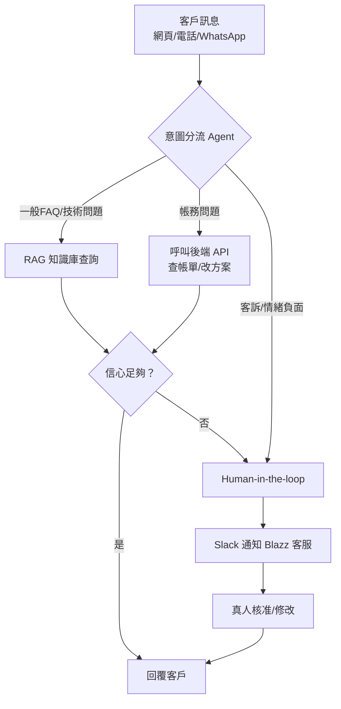

# 客服流程設計與系統架構

[← 回課程總覽](../README.md)

## 客服流程設計

設計 Blazz 的客服流程，核心邏輯是「先分流、再決定要不要查資料或做動作、最後決定要不要交給真人」，這也是[第三堂](weeks/week-3.md) Multi-agent 工作流程要落地的設計：

1. **意圖分流（Triage）**：所有訊息先進到一個判斷意圖的節點／Agent，分類成帳務、技術、一般 FAQ、或客訴／情緒負面
2. **依意圖路由**：Switch 節點依分類把對話導向對應分支——一般 FAQ／技術問題查 RAG 知識庫；帳務問題呼叫後端 API 查詢或執行交易性操作
3. **信心與例外偵測**：AI 回覆前檢查信心分數，或偵測到客戶情緒負面／重複提問，就不直接回覆，改觸發 Human-in-the-loop
4. **真人介入**：轉送 Slack，由 Blazz 客服人員核准或修改後回覆
5. **記錄與優化**：每次對話與升級案例都留 log，作為之後調整 Context 內容與分流規則的依據

下圖是整體流程：

## 前端介面設計（Voiceflow 三通路，分階段上線）

對話前端由 Voiceflow 統一設計對話流程，分階段部署到三個通路——**[第四堂](weeks/week-4.md)課堂上先做「網頁」，「WhatsApp」與「電話」排進第四堂的回家作業，由學員課後自行串接**（不再另外排一堂課，上課時間留給[第五堂](weeks/week-5.md) Hardening）：

- **網頁（Web Widget）**：把 Voiceflow 發佈後的程式碼片段嵌入 Blazz 官網／客戶入口網站，以浮動聊天視窗呈現，適合文字客服與帳務查詢（第四堂課堂）
- **電話（Voice／IVR）**：透過 Voiceflow 的語音通路，讓客戶直接撥打 Blazz 客服專線與 Agent 對話，適合不方便打字、或既有電話客服要轉型的情境（第四堂回家作業）
- **WhatsApp**：串接 Voiceflow 的 WhatsApp 整合（需連結 WhatsApp Business API／Twilio），讓客戶在既有聊天 App 裡直接互動，適合東南亞／中東等 WhatsApp 使用率高的市場（第四堂回家作業）

三個通路共用同一套 Voiceflow 對話邏輯，遇到需要查資料或執行動作時，統一透過 Webhook 呼叫 n8n 後端（RAG 查詢、開工單、查帳務、轉真人）。

## Blazz 內部客服管理（Slack Human-in-the-loop）

假想電信公司 Blazz 內部客服與工程團隊用 Slack 做管理與真人介入：

- n8n 在無法自動判斷或信心不足時，發訊息到指定頻道（例如 `#blazz-cs-escalations`），內容包含客戶原始問題、AI 判斷的意圖與理由、建議回覆
- 訊息附上 Slack 互動按鈕（Approve／Edit／Reject），真人客服可以直接核准 AI 草稿、修改後送出，或轉派給對的窗口
- 真人在 Slack 的操作會透過 n8n 寫回系統，並把最終回覆送回原本的對話通路（網頁／電話／WhatsApp）
- 這一段對應[第四堂](weeks/week-4.md)的「後端」部分
