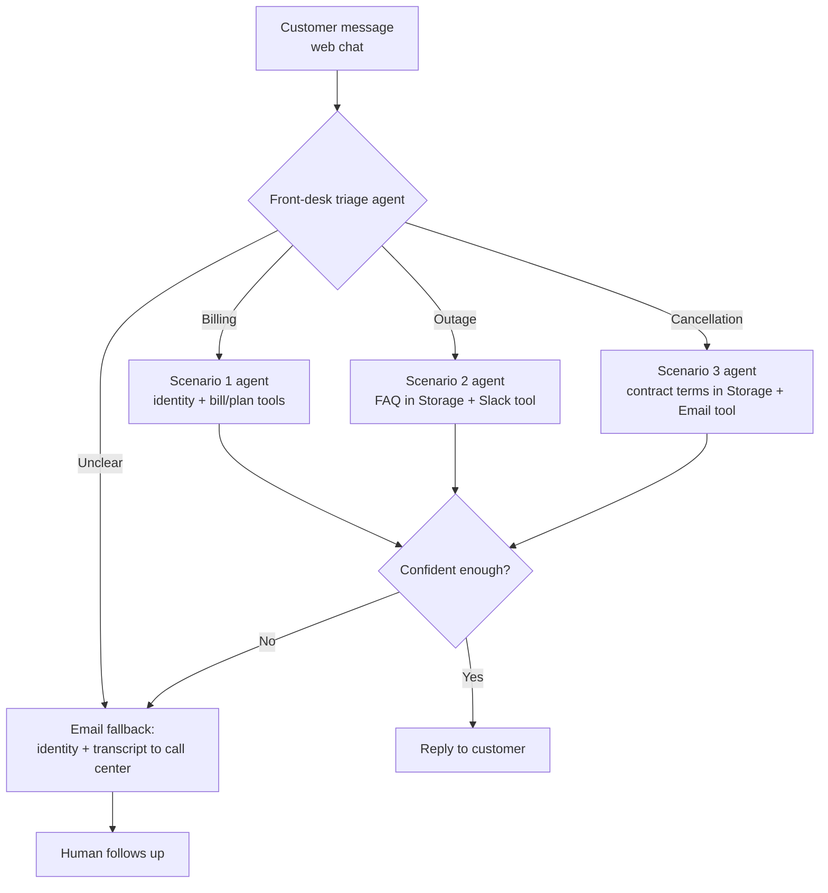

# Customer Service Flow Design & System Architecture

[← Back to course overview](README.md)

## Service Flow Design

Blazz's customer-service flow follows one core logic: "triage first, hand off to the specialist that owns this scenario, then decide whether to reply or hand off to a human." This is what [Unit 4](units/unit-4.md)'s combined workflow implements, on top of the three scenario agents built in [Unit 2](units/unit-2.md) and [Unit 3](units/unit-3.md):

1. **Front-desk triage**: every incoming message first hits a triage agent, classified as Scenario 1 (billing), Scenario 2 (outage), Scenario 3 (cancellation), or unclear
2. **Hand off to a specialist**: the matching scenario agent takes over — each has its own system prompt and Tools (Supabase database lookups for Scenario 1, an FAQ in Supabase Storage + Slack escalation tool for Scenario 2, contract terms in Supabase Storage + an Email tool for Scenario 3)
3. **Confidence check**: before replying, the workflow checks the agent's confidence score; low confidence (or an unclear triage) skips straight to the human fallback instead of guessing
4. **Human fallback**: an Email tool sends the customer's verified identity and the full conversation transcript to the call center, and the customer is told a human will follow up
5. **Logging & iteration**: every conversation and escalation gets logged, which feeds back into tuning system prompts and routing rules later

Overall flow:

## Front-End Design (n8n Chat Trigger, Web Only)

The conversational front end is n8n's own **Chat Trigger** node, in two stages:

- **Hosted Chat** ([Unit 2](units/unit-2.md)): the Chat Trigger node, set to Hosted Chat mode, serves a ready-made chat page directly — no separate front-end tool, embed code, or account needed, good for getting a working bot fast
- **Embedded Chat** ([Unit 4](units/unit-4.md)): once the combined workflow is ready, the Chat Trigger switches to Embedded mode, and its JS snippet gets dropped into a simple custom HTML page — so the chat lives on something that looks like Blazz's own site, not n8n's

This is a narrower scope than a dedicated conversational-design platform would give — web only, no phone/WhatsApp channel — traded off deliberately for one fewer tool to learn and a front end that works out of the box (see [tools.md](tools.md) for the reasoning). Data lookups and actions (Supabase queries, Slack escalation, sending email) all happen inside the same n8n workflow — no external webhook call needed, since the front end and backend are the same tool.

## Blazz Internal Support Ops (Slack & Email Human-in-the-Loop)

The fictional carrier Blazz's internal support and engineering team receive escalations two ways, depending on which scenario triggered them:

- **Slack** ([Unit 3](units/unit-3.md)): Scenario 2's troubleshooting agent posts to a designated channel (e.g. `#blazz-cs-escalations`) when a fix fails, with the conversation history and a "approve dispatch" button for a human supervisor
- **Email** ([Unit 3](units/unit-3.md) for Scenario 3's cancellation form, [Unit 4](units/unit-4.md) for the confidence-based fallback): sends either the cancellation request form, or the customer's verified identity plus the full transcript when the front-desk workflow isn't confident enough to answer alone
