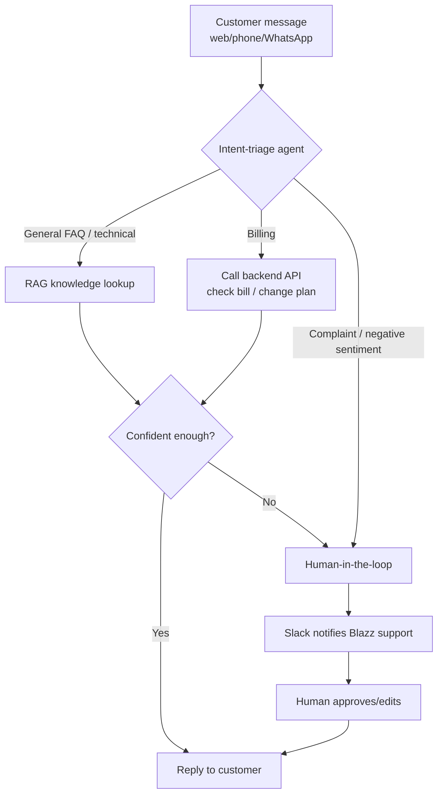

# Customer Service Flow Design & System Architecture

[← Back to course overview](README.md)

## Service Flow Design

Blazz's customer-service flow follows one core logic: "triage first, then decide whether to look something up or take an action, then decide whether to hand off to a human." This is also what [Unit 3](units/unit-3.md)'s multi-agent workflow needs to implement:

1. **Intent triage**: every incoming message first hits an intent-classification node/agent, sorted into billing, technical, general FAQ, or complaint/negative sentiment
2. **Route by intent**: a Switch node routes the conversation based on that classification — general FAQ/technical questions query the RAG knowledge base; billing questions call a backend API to look up or execute transactional operations
3. **Confidence & exception detection**: before replying, the AI checks a confidence score, or detects negative sentiment/repeated questions, and if so doesn't reply directly — it triggers human-in-the-loop instead
4. **Human handoff**: routed to Slack, where a Blazz support rep approves or edits the reply before it's sent
5. **Logging & iteration**: every conversation and escalation gets logged, which feeds back into tuning Context content and routing rules later

Overall flow:

## Front-End Design (Voiceflow, Three Channels, Staged Rollout)

The conversational front end is designed once in Voiceflow and rolled out across three channels in stages — **the web channel is built in [Unit 4](units/unit-4.md)'s class time; WhatsApp and phone are left as Unit 4 homework for the student to wire up on their own**:

- **Web (widget)**: embed the published Voiceflow snippet into Blazz's website/customer portal as a floating chat window — good for text-based support and billing lookups (built in Unit 4's class time)
- **Phone (voice/IVR)**: Voiceflow's voice channel lets customers call Blazz's support line and talk to the agent directly — good for customers who can't type, or for a legacy phone-support operation transitioning over (Unit 4 homework)
- **WhatsApp**: Voiceflow's WhatsApp integration (requires linking the WhatsApp Business API/Twilio) lets customers interact inside a chat app they already use — good for markets like Southeast Asia/Middle East with high WhatsApp usage (Unit 4 homework)

All three channels share the same Voiceflow conversation logic; whenever data needs to be looked up or an action taken, they all call the n8n backend via Webhook (RAG lookups, ticket creation, billing queries, human handoff).

## Blazz Internal Support Ops (Slack Human-in-the-Loop)

The fictional carrier Blazz's internal support and engineering team manage escalations and human handoff via Slack:

- When n8n can't decide automatically, or confidence is low, it posts to a designated channel (e.g. `#blazz-cs-escalations`) with the customer's original question, the AI's classified intent and reasoning, and a suggested reply
- The message includes interactive Slack buttons (Approve/Edit/Reject) — a human agent can approve the AI's draft as-is, edit it before sending, or reassign it to the right person
- Whatever the human does in Slack gets written back through n8n, and the final reply goes out through the original conversation channel (web/phone/WhatsApp)
- This corresponds to the "backend" portion of [Unit 4](units/unit-4.md)
