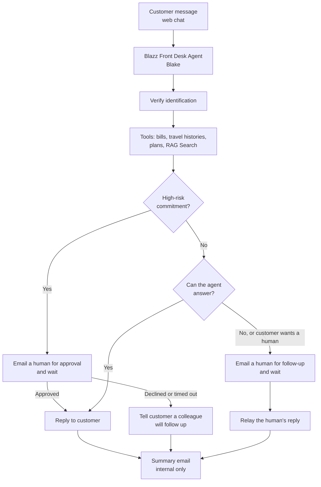

# Customer Service Flow Design & System Architecture

[← Back to course overview](README.md)

## Service Flow Design

Blazz's customer-service flow follows one core logic: "one front-desk agent, the right tool for each job, and a human whenever the stakes or the unknowns are too high." This is what [Unit 5](units/unit-5.md)'s Blazz Front Desk Agent implements, on top of the three scenarios built in [Unit 2](units/unit-2.md), [Unit 3](units/unit-3.md) and [Unit 4](units/unit-4.md):

1. **Single entry point**: every incoming message goes to one agent, Blake. There is no separate triage step; the agent reads each tool's description and decides which one to call
2. **Verify, then look up**: the agent verifies the customer's identity first, then uses its tools — Supabase lookups for bills, travel histories and plans, and a RAG Search sub-workflow over the Blazz knowledge base
3. **Real-time approval**: before promising anything free, discounted, refunded, cancelled or changed, the agent emails a human and waits for Approve or Decline. Anything other than an explicit approval counts as "not approved"
4. **Human follow-up**: when the agent can't answer, or the customer asks for a person, it emails a human, waits for the reply, and relays only what the human actually wrote
5. **Summary email**: when the conversation ends, the agent sends an internal-only summary email

Overall flow:

```mermaid
flowchart TD
    A[Customer message<br/>web chat] --> B[Blazz Front Desk Agent<br/>Blake]
    B --> C[Verify identification]
    C --> D[Tools: bills, travel histories,<br/>plans, RAG Search]
    D --> E{High-risk<br/>commitment?}
    E -->|Yes| F[Email a human for approval<br/>and wait]
    F -->|Approved| G[Reply to customer]
    F -->|Declined or timed out| H[Tell customer a colleague<br/>will follow up]
    E -->|No| I{Can the agent<br/>answer?}
    I -->|Yes| G
    I -->|No, or customer wants a human| J[Email a human for follow-up<br/>and wait]
    J --> K[Relay the human's reply]
    G --> L[Summary email<br/>internal only]
    H --> L
    K --> L
```

## Front-End Design (n8n Chat Trigger, Web Only)

The conversational front end is n8n's own **Chat Trigger** node in **Hosted Chat** mode ([Unit 2](units/unit-2.md)): it serves a ready-made chat page directly — no separate front-end tool, embed code, or account needed, good for getting a working bot fast. The same hosted page is used for the rest of the course.

This is a narrower scope than a dedicated conversational-design platform would give — web only, no phone/WhatsApp channel — traded off deliberately for one fewer tool to learn and a front end that works out of the box (see [tools.md](tools.md) for the reasoning). Data lookups and actions (Supabase queries, Slack escalation, sending email) all happen inside the same n8n workflow — no external webhook call needed, since the front end and backend are the same tool.

## Blazz Internal Support Ops (Slack & Email Human-in-the-Loop)

The fictional carrier Blazz's internal support and engineering team receive escalations two ways, depending on which scenario triggered them:

- **Slack** ([Unit 3](units/unit-3.md)): Scenario 2's troubleshooting agent posts to a designated channel (e.g. `#blazz-cs-escalations`) when a fix fails, with the conversation history and a "approve dispatch" button for a human supervisor
- **Email** ([Unit 3](units/unit-3.md) for Scenario 1's Plan Change Request SOP and Scenario 3's cancellation form, [Unit 5](units/unit-5.md) for the Front Desk Agent's real-time approval, human follow-up and summary emails): the approval and follow-up emails pause the workflow until a human responds; the summary email is an internal record only
