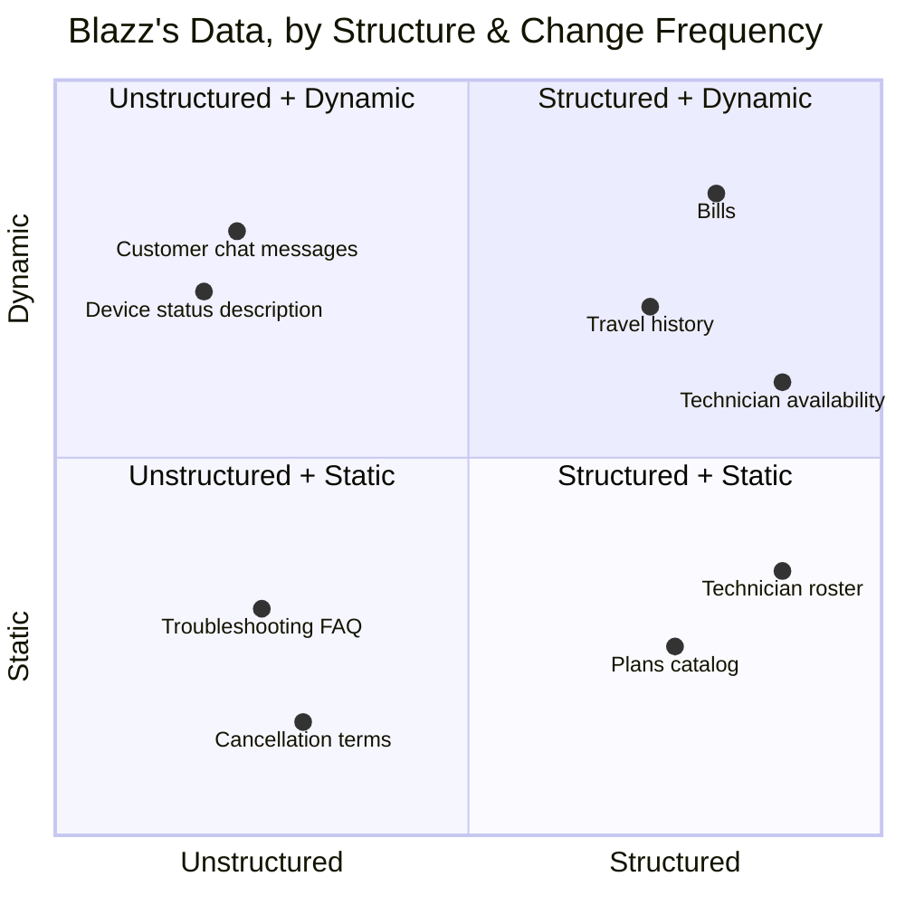

# Data Crash Course: Relational DB → PostgreSQL → Supabase → LLM

[← Back to course overview](README.md)

A short reference for explaining where our data concepts fit together — relational databases, PostgreSQL, Supabase, and why unstructured data needs an LLM. Meant to be a quick class explainer, not a full lecture.

## A. The Big Picture

- **Relational database** = a *method* for organizing data: several linked spreadsheets instead of one giant messy one.
- **PostgreSQL** = the actual *software* that stores data this way and understands query commands (SQL).
- **Supabase** = a *service* that sets up PostgreSQL for you in the cloud, gives you a dashboard, and auto-builds an API — so you never touch a server.

> Relational database = the *idea* of linked spreadsheets. PostgreSQL = the *engine* that runs the idea. Supabase = the *service* that plugs the engine in for you.

## B. Structured Data 101

**Structured data** = data that fits neatly into rows and columns, where every row has the same fields and each field has a fixed type (text, number, date...).

Example from our own `customers` table (see [mock-data.md](mock-data.md)):

| id (PK) | full_name | phone_number | plan_id (FK) |
|---|---|---|---|
| 1 | David Kim | 416-555-0102 | 2 |
| 2 | Priya Sharma | 647-555-0198 | 1 |

- **PK (Primary Key)** — the column that uniquely identifies each row. `id` here: no two customers share one.
- **FK (Foreign Key)** — a column that *points to* a PK in another table. `plan_id = 2` means "go look up row `id = 2` in the `plans` table" instead of repeating "monthly $60, 20GB, no roaming" on every customer row.

That link between tables (FK → PK) is exactly what makes it "relational."

**Common software that implements this (the engine):**

| Software | Notes |
|---|---|
| **PostgreSQL** | Open-source, what we use |
| **MySQL** | Open-source, very common in web apps |
| **SQL Server** | Microsoft's |
| **Oracle Database** | Enterprise, older large companies |
| **SQLite** | Lightweight, runs inside an app (no server) |

**Common services that host it for you (the platform):**

| Platform | Built on |
|---|---|
| **Supabase** | PostgreSQL — what we use |
| **Neon** | PostgreSQL |
| **AWS RDS / Aurora** | Postgres, MySQL, others |
| **Google Cloud SQL** | Postgres, MySQL |
| **PlanetScale** | MySQL |

## C. Unstructured Data → Why We Need LLMs

Most real-world data does **not** fit into neat rows and columns — a PDF, a Word doc, a photo, or a customer typing "my internet has been down since this morning" in chat. A traditional database can *store* these as files, but it can't *understand* what's inside them. That's where an LLM comes in — it can read and reason over messy, unstructured content the way a person would.

**In this course**, unstructured data lives in **Supabase Storage** (not a table):

| File | Format | Used in |
|---|---|---|
| Troubleshooting FAQ (device models, status-light meanings, steps) | multiple .pdf / .doc articles | Scenario 2 (Outage) |
| Termination / cancellation terms | .pdf / .doc | Scenario 3 (Cancellation) |
| Reference photos, if any | .jpg | — |

And there's a second, even more obvious source of unstructured data: **every message the customer types into the chat.** "My wifi died an hour ago" isn't a row in a table — Blake (our LLM agent) has to *read* it, figure out the intent, and decide which Tool to call. That's the whole reason this workshop is "agent + LLM" and not just "form + database."

## D. The Full Map: Structured vs Unstructured × Static vs Dynamic

Putting B and C on one chart, using data we actually use in class:

| Quadrant | Example (from our schema) | Lives in |
|---|---|---|
| **Structured + Dynamic** | `bills` (new row every month), `travel_histories`, `technician_availability` (booked/free changes per slot) | Supabase Database — queried live by Tools |
| **Structured + Static** | `plans` (rate plan catalog), `technicians` roster (name/region rarely changes) | Supabase Database — lookup/reference tables |
| **Unstructured + Dynamic** | The customer's live chat messages ("my wifi died an hour ago," "my light is orange") — including their own description of device status | Never stored as a table — read straight by the LLM |
| **Unstructured + Static** | Troubleshooting FAQ (Scenario 2) — status-light meanings, per-device steps, escalation criteria; cancellation/contract terms (Scenario 3) | Supabase Storage — fetched by a Tool, read by the LLM |

Notice the pattern: **the right side (structured) is what our database Tools query; the left side (unstructured) is only usable because we have an LLM to read it.** That's the one-sentence reason this course pairs Supabase with an LLM agent instead of just building a plain database app.

**A common trap in Scenario 2**: "what color is this customer's status light right now" looks like it wants a `devices` table you can query. But the customer already says it in chat ("my light is orange") — that's Unstructured + Dynamic, read straight by the LLM, no table needed. What actually belongs in a document is the *meaning* — what orange means, what to do about it, when to escalate — which is Unstructured + Static, and that's what the RAG lookup is for. If you catch yourself building a table to hold something the customer already typed, that's usually a sign it belongs on the left side of this chart instead.
